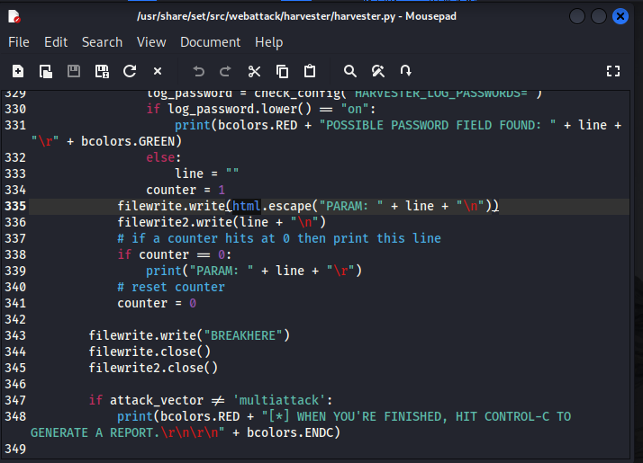

# Phishing para captura de senhas

### Ferramentas

- Kali Linux
- setoolkit

### Configurando o Phishing no Kali Linux

- Acesso root: ``` sudo su ```
- Iniciando o setoolkit: ``` setoolkit ```
- Tipo de ataque: ``` Social-Engineering Attacks ```

  
- Vetor de ataque: ``` Web Site Attack Vectors ```

  
- Método de ataque: ```Credential Harvester Attack Method ```

  
- Método de ataque: ``` Site Cloner ```
  

  
- Obtendo o endereço da máquina: ``` ifconfig ``` ou utilizando o próprio endereço ip sugerido 


- URL para clone: https://cursos.alura.com.br/loginForm


### Resutados

- Informando um usuário e senha:
  


- Usuário e senha capturados:


### Informes
-Antes de funcionar o Phishing ocorreram alguns erros em relação a captura da senha por conta de um bug --> "AttributeError: module 'cgi' has no attribute 'escape'"
-Esse erro ocorre porque, a partir do Python 3.8, o método cgi.escape() foi removido. Esse método era utilizado para converter caracteres especiais em entidades HTML.
-Para resolver esse erro é necessário modificar no arquivo python "cgi.escape("PARAM: " + line + "\n")" para html.escape("PARAM: " + line + "\n")

``` Passos: ```
- Abrir o explorador de arquivos no endereço: /usr/share/set/src/webattack/harvester/harvester.py:


- Importar o html:


- Mudar o codigo cgi.escape("PARAM: " + line + "\n") para html.escape("PARAM: " + line + "\n"):


- Após essas alterações é só salvar e testar
- Link para vídeo de explicação no youtube: https://youtu.be/aM5yjJ8JUME?si=wRDORgmeoqcl-1s4


